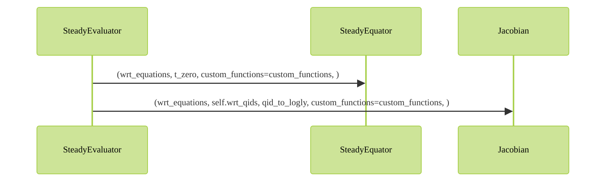

```mermaid

%%{init: {
    'theme': 'forest',
    'fontFamily': 'trebuchet ms',
	'fontSize': 12
}}%%


sequenceDiagram
    participant SE as SteadyEvaluator
    participant SQ as SteadyEquator
    participant JA as Jacobian
    SE->>SQ: (wrt_equations, t_zero, custom_functions=custom_functions, )
	SE->>JA: (wrt_equations, self.wrt_qids, qid_to_logly, custom_functions=custom_functions, )
```
